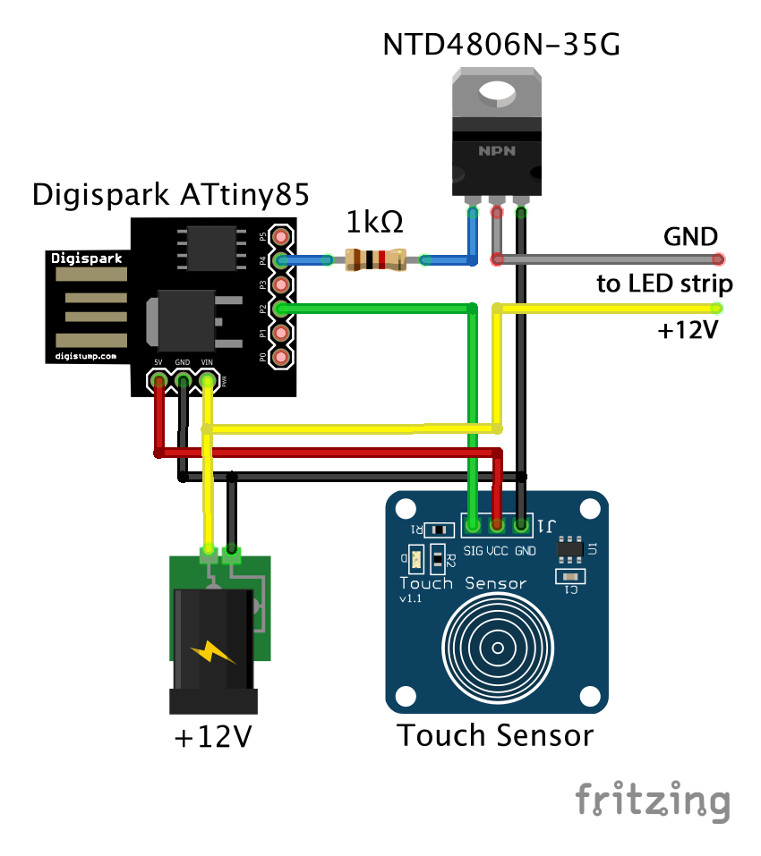

# 5 Levels LED strip Controller

This is a simple project based on ATtiny85 microcontroller to control an LED strip using basically a Digispark Attiny85 board, a capacitive touch sensor and a MOSFET transistor.

#### Schematics:

#### Parts:
- Digispark Attiny85 USB board.
- NTD4806N-35G N-Channel MOSFET Transistor.
- TTP223B Capacitive Touch Sensor
- 1K ohm resistor.
- 12V LED strip.
- 12V power supply.